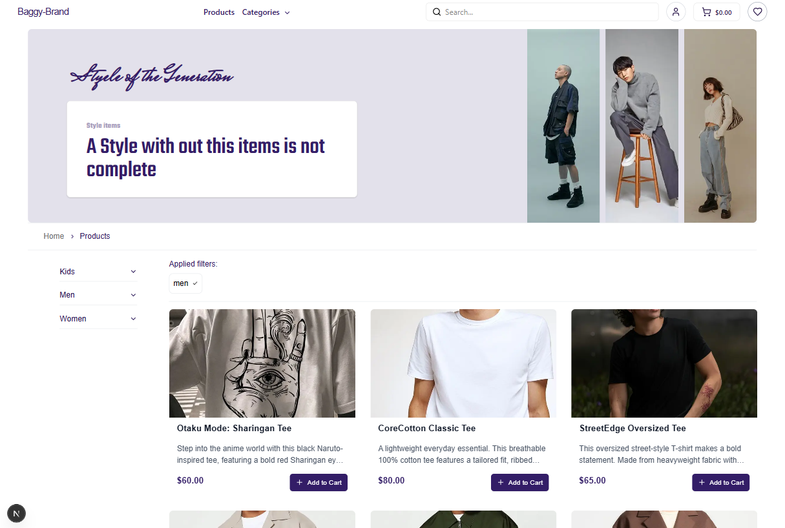

---

# Brand Baggy

A full-stack e-commerce platform built with Django (backend) and Next.js/React (frontend).

---
## Buyer side 

## seller side  (admin)


## Features

### User Management
- **Authentication & Authorization:** Secure login and registration for buyers and sellers, with JWT-based authentication.
- **Role-based Access:** Separate dashboards and permissions for sellers, buyers, and admins.

### Product Management
- **CRUD Operations:** Sellers can create, update, and delete products.
- **Image Uploads:** Product images are managed via Cloudinary.
- **Product Variants:** Support for product sizes, colors, and other variants.
- **Stock & Pricing:** Real-time stock management and discount support.

### Order Management
- **Order Placement:** Buyers can place orders for products in their cart.
- **Order Tracking:** Sellers and buyers can view order status and details.
- **Admin Order Table:** Admins can view all orders in the system.
- **Order Status Updates:** Sellers can update order and payment statuses.

### Cart & Checkout
- **Cart Functionality:** Add, update, and remove products from the cart.
- **Checkout Flow:** Seamless checkout with shipping info and payment method selection.
- **Guest Checkout:** Support for guest users to place orders.

### Payment Integration
- **Stripe & PayPal:** Multiple payment providers supported.
- **Payment Status Tracking:** Real-time updates on payment status for each order.

### Analytics & Dashboard
- **Seller Dashboard:** Sales analytics, recent orders, and performance metrics for sellers.
- **Admin Analytics:** System-wide analytics for admins.

### Notifications
- **Real-time Notifications:** Order and payment updates via Django Channels/WebSockets.
#### **Email Notifications:**
- **Order Delivered:** Sends an email to the customer requesting a review and rating for their delivered order.
- **Payment Confirmation:** Sends a payment receipt email to the customer when payment is completed.
- **Order Confirmations:** Customers receive confirmation emails when they place an order.

### CSV Export
- **Seller Order Export:** Sellers can export their orders as a CSV file for reporting or bookkeeping.

### UI/UX
- **Responsive Design:** Mobile-friendly and desktop-optimized layouts.
- **Modern UI:** Built with Tailwind CSS and custom components.
- **Hidden Scrollbars:** Clean look with scrollbars hidden on key containers.

### Miscellaneous
- **Docker Support:** Dockerfiles and docker-compose for easy local development.
- **Environment Variables:** `.env` support for configuration and secrets.
- **Extensible:** Modular codebase for easy feature addition and maintenance.

---

## Tech Stack

- **Backend:** Django, Django REST Framework, Celery, PostgreSQL
- **Frontend:** Next.js (App Router), React, Tailwind CSS
- **Other:** Cloudinary, Stripe, PayPal, Redis (for Celery/Channels)

---

## Getting Started

### Backend

1. **Install dependencies:**
   ```bash
   cd server
   pip install -r requirements.txt
   ```
2. **Set up environment variables:**  
   Copy `.env.example` to `.env` and fill in your secrets.
3. **Run migrations:**
   ```bash
   python manage.py migrate
   ```
4. **Create a superuser (admin):**
   ```bash
   python manage.py createsuperuser
   ```
5. **Start the server:**
   ```bash
   python manage.py runserver
   ```

### Frontend

1. **Install dependencies:**
   ```bash
   cd client
   npm install
   ```
2. **Set up environment variables:**  
   Copy `.env.example` to `.env` and fill in your API URLs and secrets.
3. **Start the dev server:**
   ```bash
   npm run dev
   ```

---

## Usage

- **Admin Panel:** `/admin/`
- **Seller Dashboard:** `/seller/dashboard/`
- **Buyer Dashboard:** `/profile/`
- **Product Management:** `/seller/products/`
- **Order Management:** `/seller/orders/` and `/profile/orders/`
- **CSV Export:**  
  Sellers can download their orders as CSV from `/orders/order/export-csv/`
- **API:**  
  All backend APIs are under `/orders/`, `/product/`, `/cart/`, `/payment/`, etc.

---

## Development Notes

- **Scrollbars:**  
  Scrollbars are hidden on key containers for a clean look using inline CSS and custom classes.
- **CSV Export:**  
  Use the `/orders/order/export-csv/` endpoint for seller order exports.
- **Custom Tailwind Utilities:**  
  You can add more utilities in `tailwind.config.js` as needed.
- **Celery/Redis:**  
  For background tasks and real-time features, ensure Redis is running.

---

## Docker (Optional)

To run the project with Docker:

```bash
docker-compose up --build
```

---

## License

MIT

---
